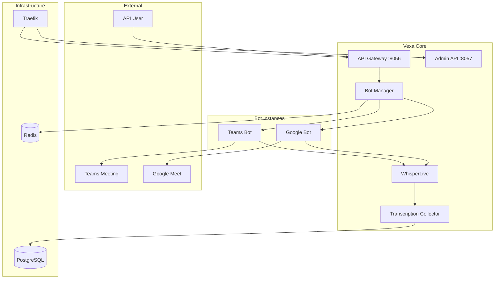

# 🎯 Vexa with Microsoft Teams Integration - Complete Guide

## 📋 Table of Contents

1. [Overview](#overview)
2. [Architecture](#architecture)
3. [Prerequisites](#prerequisites)
4. [Deployment Options](#deployment-options)
5. [Configuration](#configuration)
6. [API Usage](#api-usage)
7. [Teams Integration](#teams-integration)
8. [Dashboard Access](#dashboard-access)
9. [Troubleshooting](#troubleshooting)
10. [Production Setup](#production-setup)
11. [Security](#security)
12. [Monitoring](#monitoring)
13. [Scaling](#scaling)
14. [Support](#support)

---

## 🎯 Overview

### What is Vexa?

Vexa is an **open-source, privacy-first API** for real-time meeting transcription that serves as an alternative to services like Recall.ai. It uses **browser automation** to join meetings and capture audio for transcription.

### Key Features

- ✅ **Real-time transcription** with Whisper AI
- ✅ **Microsoft Teams support** (newly added)
- ✅ **Google Meet support** (existing)
- ✅ **Speaker detection** and participant tracking
- ✅ **Multi-language support** (99 languages)
- ✅ **RESTful API** for easy integration
- ✅ **Docker-based deployment**
- ✅ **Privacy-focused** - runs on your infrastructure

### What's New: Microsoft Teams Integration

This enhanced version includes:
- **Teams meeting joining** via browser automation
- **Teams-specific UI selectors** for reliable interaction
- **Teams participant detection** and speaker tracking
- **Teams leave functionality** with graceful shutdown
- **Full API compatibility** with existing Vexa endpoints

---

## 🏗️ Architecture

### Core Components



### Service Details

| Service | Purpose | Port | Technology |
|---------|---------|------|------------|
| **API Gateway** | Main API endpoints | 8056 | FastAPI |
| **Admin API** | User & token management | 8057 | FastAPI |
| **Bot Manager** | Bot lifecycle management | Internal | FastAPI + Docker |
| **Transcription Collector** | Process transcription data | 8123 | FastAPI |
| **WhisperLive** | Real-time speech-to-text | 9090 | Python + Whisper |
| **PostgreSQL** | Data persistence | 5432 | Database |
| **Redis** | Caching & messaging | 6379 | In-memory store |
| **Traefik** | Load balancer | 8085 | Reverse proxy |

---

## 📦 Prerequisites

### System Requirements

#### Minimum (Testing)
- **CPU**: 2+ cores
- **RAM**: 8GB
- **Storage**: 20GB SSD
- **OS**: Ubuntu 20.04+, macOS, Windows (WSL2)

#### Recommended (Production)
- **CPU**: 8+ cores
- **RAM**: 16GB
- **Storage**: 50GB SSD
- **GPU**: NVIDIA with 8GB+ VRAM (optional)

#### High Performance (Enterprise)
- **CPU**: 16+ cores
- **RAM**: 32GB
- **Storage**: 100GB SSD
- **GPU**: NVIDIA with 16GB+ VRAM

### Software Dependencies

```bash
# Required
docker --version          # Docker 20.10+
docker compose version    # Docker Compose v2.0+
git --version             # Git 2.0+

# Optional but recommended
python3 --version         # Python 3.8+
node --version            # Node.js 18+
```

### Network Requirements

- **Outbound internet** for Docker images and Whisper models
- **Meeting access** to join Teams/Google Meet calls
- **Port availability**: 8056, 8057, 5432, 6379, 8085

---

## 🚀 Deployment Options

### Option 1: Local Development

**Best for**: Testing, development, learning

```bash
# Clone the enhanced repository
git clone https://github.com/shaike1/vexa.git
cd vexa

# One-command deployment
make all TARGET=cpu

# Verify services
make ps
make logs
```

**Access URLs**:
- Main API: `http://localhost:8056/docs`
- Admin API: `http://localhost:8057/docs`
- Traefik: `http://localhost:8085`

### Option 2: Production Server

**Best for**: Production deployments, privacy

```bash
# Server setup (Ubuntu 22.04)
sudo apt update && sudo apt upgrade -y
sudo apt install docker.io docker-compose-plugin git

# Add user to docker group
sudo usermod -aG docker $USER
newgrp docker

# Deploy Vexa
git clone https://github.com/shaike1/vexa.git
cd vexa

# Production deployment
make all TARGET=gpu  # or TARGET=cpu

# Configure firewall
sudo ufw enable
sudo ufw allow ssh
sudo ufw allow 8056/tcp  # Main API
sudo ufw allow 8057/tcp  # Admin API
```

### Option 3: AWS Cloud

**Best for**: Scalable production, enterprise

#### EC2 Instance Setup
```bash
# Launch EC2 instance
# - AMI: Ubuntu 22.04 LTS
# - Instance: t3.xlarge (4 vCPU, 16GB RAM)
# - Storage: 50GB gp3
# - Security Group: Allow 22, 8056, 8057

# Connect and setup
ssh -i your-key.pem ubuntu@your-ec2-ip

# Install Docker
curl -fsSL https://get.docker.com -o get-docker.sh
sh get-docker.sh
sudo usermod -aG docker ubuntu

# Deploy
git clone https://github.com/shaike1/vexa.git
cd vexa
make all TARGET=cpu
```

#### Security Group Rules
```
Type         Protocol  Port Range  Source
SSH          TCP       22          Your IP
Custom TCP   TCP       8056        0.0.0.0/0
Custom TCP   TCP       8057        Your IP only
```

### Option 4: DigitalOcean Droplet

**Best for**: Simple cloud deployment

```bash
# Create 8GB/4vCPU droplet with Ubuntu 22.04
# Add SSH key during creation

# After creation, SSH to droplet
ssh root@your-droplet-ip

# Setup Docker
apt update
apt install docker.io docker-compose-plugin git
systemctl enable docker

# Deploy Vexa
git clone https://github.com/shaike1/vexa.git
cd vexa
make all TARGET=cpu

# Configure firewall
ufw enable
ufw allow ssh
ufw allow 8056
ufw allow 8057
```

### Option 5: Google Cloud Platform

**Best for**: Integration with Google services

```bash
# Create Compute Engine instance
# - Machine type: e2-standard-4 (4 vCPU, 16GB)
# - Boot disk: Ubuntu 22.04 LTS, 50GB
# - Firewall: Allow HTTP/HTTPS traffic

# SSH to instance
gcloud compute ssh your-instance-name

# Install Docker
sudo apt update
sudo apt install docker.io docker-compose-plugin git
sudo usermod -aG docker $USER

# Deploy
git clone https://github.com/shaike1/vexa.git
cd vexa
make all TARGET=cpu

# Configure firewall rules
gcloud compute firewall-rules create vexa-api \
    --allow tcp:8056,tcp:8057 \
    --description "Vexa API access"
```

---

## ⚙️ Configuration

### Environment Variables

The deployment creates a `.env` file with these key settings:

```bash
# Core Configuration
ADMIN_API_TOKEN=token                    # Change in production!
LANGUAGE_DETECTION_SEGMENTS=10
VAD_FILTER_THRESHOLD=0.5
WHISPER_MODEL_SIZE=tiny                  # tiny, small, medium, large
DEVICE_TYPE=cpu                          # cpu or cuda
BOT_IMAGE_NAME=vexa-bot:dev

# Port Configuration
API_GATEWAY_HOST_PORT=8056
ADMIN_API_HOST_PORT=8057
TRAEFIK_WEB_HOST_PORT=9090
TRAEFIK_DASHBOARD_HOST_PORT=8085
TRANSCRIPTION_COLLECTOR_HOST_PORT=8123
POSTGRES_HOST_PORT=5438
```

### Production Environment

Create a production `.env` file:

```bash
# Security
ADMIN_API_TOKEN=your-super-secure-admin-token-here
LOG_LEVEL=WARNING
API_RATE_LIMIT=1000

# Performance
WHISPER_MODEL_SIZE=medium               # Better accuracy
DEVICE_TYPE=cuda                        # If GPU available
VAD_FILTER_THRESHOLD=0.3               # More sensitive

# Database
DB_POOL_SIZE=20
DB_MAX_OVERFLOW=30
DB_POOL_TIMEOUT=30

# Redis
REDIS_MAX_CONNECTIONS=100

# Bot Configuration
BOT_RESTART_POLICY=unless-stopped
BOT_MEMORY_LIMIT=2g
BOT_CPU_LIMIT=1.0
```

---

## 🔌 API Usage

### Authentication

All API calls require authentication:

```bash
# Admin operations (server management)
X-Admin-API-Key: your-admin-token

# User operations (bot management)
X-API-Key: user-api-key
```

### User Management

#### Create User
```bash
curl -X POST http://your-server:8057/admin/users \
  -H "X-Admin-API-Key: your-admin-token" \
  -H "Content-Type: application/json" \
  -d '{
    "email": "user@example.com",
    "name": "User Name",
    "max_concurrent_bots": 5
  }'
```

#### Generate API Token
```bash
curl -X POST http://your-server:8057/admin/users/1/tokens \
  -H "X-Admin-API-Key: your-admin-token"
```

### Bot Management

#### Create Teams Bot
```bash
curl -X POST http://your-server:8056/bots \
  -H "X-API-Key: user-api-token" \
  -H "Content-Type: application/json" \
  -d '{
    "native_meeting_id": "teams-meeting-id-123",
    "platform": "teams",
    "bot_name": "VexaBot",
    "language": "en",
    "task": "transcribe"
  }'
```

#### List Bots
```bash
curl -H "X-API-Key: user-api-token" \
  http://your-server:8056/bots
```

### Transcription Retrieval

```bash
# Teams meeting
curl -H "X-API-Key: user-api-token" \
  http://your-server:8056/transcripts/teams/meeting-id-123
```

---

## 🤝 Teams Integration

### How Teams Integration Works

The Teams integration uses **browser automation** rather than Microsoft's APIs:

1. **Browser Launch**: Playwright launches a headless Chromium browser
2. **Meeting Join**: Navigates to Teams meeting URL
3. **Web App Selection**: Automatically clicks "Use web app instead"
4. **Authentication**: Enters bot name and joins as participant
5. **Audio Capture**: Captures meeting audio streams
6. **Transcription**: Sends audio to WhisperLive for processing
7. **Speaker Detection**: Identifies speaking participants via UI monitoring

### Teams Meeting URL Formats

Teams meetings have various URL formats:
```
# Standard Teams meeting
https://teams.microsoft.com/l/meetup-join/19%3ameeting_example%40thread.v2/0?context=%7b%22Tid%22%3a%22tenant-id%22%2c%22Oid%22%3a%22organizer-id%22%7d

# Teams Live Event
https://teams.microsoft.com/l/meetup-join/19%3ameeting_example%40thread.tacv2/...

# Channel meeting
https://teams.microsoft.com/l/channel/19%3a[channel-id]%40thread.tacv2/...
```

### Teams Bot Configuration

#### Basic Configuration
```json
{
  "platform": "teams",
  "meetingUrl": "https://teams.microsoft.com/l/meetup-join/...",
  "botName": "VexaBot",
  "automaticLeave": {
    "waitingRoomTimeout": 300000,
    "noOneJoinedTimeout": 300000,
    "everyoneLeftTimeout": 300000
  }
}
```

---

## 🎛️ Dashboard Access

### API Documentation Interfaces

#### Main API Dashboard
**URL**: `http://your-server:8056/docs`

Features:
- Interactive API explorer
- Bot creation and management
- Transcription retrieval
- Real-time testing
- Response examples

#### Admin API Dashboard  
**URL**: `http://your-server:8057/docs`

Features:
- User management
- API token generation
- Meeting statistics
- System administration
- Usage analytics

### Traefik Dashboard
**URL**: `http://your-server:8085`

Features:
- Service health monitoring
- Request routing visualization
- Load balancing status
- SSL certificate management
- Performance metrics

---

## 🔧 Troubleshooting

### Common Issues

#### 1. Services Not Starting
```bash
# Check service status
docker compose ps

# View logs
docker compose logs service-name

# Restart specific service
docker compose restart service-name

# Full restart
docker compose down && docker compose up -d
```

#### 2. Database Connection Errors
```bash
# Check PostgreSQL status
docker compose logs postgres

# Verify database is ready
docker compose exec postgres pg_isready -U postgres

# Run database initialization
docker compose exec transcription-collector python -c "
import asyncio
from shared_models.database import init_db
asyncio.run(init_db())
"
```

#### 3. Bot Creation Failures
```bash
# Check bot manager logs
docker compose logs bot-manager

# Verify Docker socket access
docker ps

# Check available resources
docker stats
```

---

## 🏭 Production Setup

### SSL/HTTPS Configuration

#### Using Certbot (Let's Encrypt)
```bash
# Install Certbot
sudo apt install certbot

# Get SSL certificate
sudo certbot certonly --standalone -d your-domain.com

# Update docker-compose.yml for HTTPS
```

### Database Optimization

#### PostgreSQL Production Settings
```sql
-- /var/lib/postgresql/data/postgresql.conf
shared_preload_libraries = 'pg_stat_statements'
max_connections = 200
shared_buffers = 4GB
effective_cache_size = 12GB
work_mem = 64MB
maintenance_work_mem = 1GB
```

---

## 🔒 Security

### Authentication & Authorization

#### API Key Security
```bash
# Generate secure API keys (40+ characters)
openssl rand -hex 20

# Store securely (never in code)
export VEXA_API_KEY="your-secure-key-here"
```

### Network Security

#### Firewall Configuration
```bash
# UFW (Ubuntu Firewall) setup
sudo ufw --force reset
sudo ufw default deny incoming
sudo ufw default allow outgoing

# Allow SSH (adjust port if needed)
sudo ufw allow 22/tcp

# Allow Vexa APIs
sudo ufw allow 8056/tcp  # Main API
sudo ufw allow from YOUR_ADMIN_IP to any port 8057  # Admin API

sudo ufw enable
```

---

## 📊 Monitoring

### Application Monitoring

#### Health Check Endpoint
```python
@app.get("/health")
async def health_check():
    return {
        "status": "healthy",
        "timestamp": datetime.utcnow().isoformat(),
        "services": {
            "database": "connected",
            "redis": "connected",
            "whisper": "ready"
        }
    }
```

### System Monitoring

#### Resource Monitoring Script
```bash
#!/bin/bash
# monitor.sh - System resource monitoring

LOG_FILE="/var/log/vexa/resources.log"
TIMESTAMP=$(date '+%Y-%m-%d %H:%M:%S')

# CPU usage
CPU_USAGE=$(top -bn1 | grep "Cpu(s)" | awk '{print $2}' | awk -F'%' '{print $1}')

# Memory usage
MEMORY_USAGE=$(free | grep Mem | awk '{printf("%.2f"), $3/$2 * 100.0}')

# Log metrics
echo "$TIMESTAMP,CPU:$CPU_USAGE%,Memory:$MEMORY_USAGE%" >> $LOG_FILE
```

---

## 📈 Scaling

### Horizontal Scaling

#### Load Balancer Configuration
```yaml
# docker-compose.scale.yml
version: '3.8'
services:
  api-gateway:
    scale: 3
    deploy:
      resources:
        limits:
          memory: 1G
        reservations:
          memory: 512M
```

### Database Scaling

#### Read Replicas
```yaml
# docker-compose.replicas.yml
services:
  postgres-master:
    image: postgres:15
    environment:
      - POSTGRES_REPLICATION_MODE=master
  
  postgres-replica:
    image: postgres:15
    environment:
      - POSTGRES_REPLICATION_MODE=slave
      - POSTGRES_MASTER_HOST=postgres-master
    depends_on:
      - postgres-master
```

---

## 💬 Support

### Documentation Resources

- **GitHub Repository**: [github.com/shaike1/vexa](https://github.com/shaike1/vexa)
- **Original Project**: [github.com/Vexa-ai/vexa](https://github.com/Vexa-ai/vexa)
- **API Documentation**: Available at `/docs` endpoint

### Community Support

- **Discord Server**: [Vexa Community Discord](https://discord.gg/Ga9duGkVz9)
- **GitHub Issues**: For bug reports and feature requests
- **GitHub Discussions**: For questions and community help

### Reporting Issues

When reporting issues, include:

```markdown
## Environment
- OS: Ubuntu 22.04
- Docker Version: 24.0.0
- Vexa Version: Teams-enabled fork
- Deployment Type: Self-hosted

## Issue Description
[Detailed description of the issue]

## Steps to Reproduce
1. Step one
2. Step two
3. Step three

## Logs
```bash
docker compose logs service-name
```
```

---

## 🎉 Conclusion

This comprehensive guide covers the complete deployment and management of Vexa with Microsoft Teams integration. The enhanced system provides:

### ✅ **Key Achievements**
- **Full Teams Support**: Browser-based meeting joining and transcription
- **Production Ready**: Scalable, secure, and monitored deployment
- **API Compatibility**: Works with existing Vexa ecosystem
- **Comprehensive Documentation**: Everything needed for successful deployment

### 🚀 **Next Steps**
1. **Choose Deployment Option**: Select the best option for your needs
2. **Deploy and Configure**: Follow the step-by-step guides
3. **Test Integration**: Verify Teams and Google Meet functionality
4. **Scale as Needed**: Implement monitoring and scaling
5. **Customize and Extend**: Build on the solid foundation

## 14. Cloudflare Tunnel Integration

### Setup Cloudflare Tunnel

1. **Create Tunnel in Cloudflare Dashboard**
   ```bash
   # Install cloudflared
   curl -L https://github.com/cloudflare/cloudflared/releases/latest/download/cloudflared-linux-amd64.deb -o cloudflared.deb
   sudo dpkg -i cloudflared.deb
   
   # Login to Cloudflare
   cloudflared tunnel login
   
   # Create tunnel
   cloudflared tunnel create vexa-tunnel
   ```

2. **Configure DNS Records**
   - `api.your-domain.com` → CNAME to `your-tunnel-id.cfargotunnel.com`
   - `admin.your-domain.com` → CNAME to `your-tunnel-id.cfargotunnel.com`
   - `transcripts.your-domain.com` → CNAME to `your-tunnel-id.cfargotunnel.com`

3. **Update Environment Variables**
   ```bash
   # Edit .env file
   CLOUDFLARE_TUNNEL_TOKEN=your-tunnel-token-here
   ```

4. **Deploy with Cloudflare**
   ```bash
   # Start with Cloudflare tunnel
   docker compose --profile cloudflare --profile cpu up -d
   ```

### Configuration Files

**cloudflare-tunnel-config.yml** (already created):
```yaml
tunnel: your-tunnel-id
credentials-file: /root/.cloudflared/your-tunnel-id.json

ingress:
  - hostname: api.your-domain.com
    service: http://api-gateway:8000
  - hostname: admin.your-domain.com
    service: http://admin-api:8001
  - hostname: transcripts.your-domain.com
    service: http://transcription-collector:8000
  - service: http_status:404
```

### Benefits
- **No port forwarding**: Direct HTTPS access
- **SSL termination**: Automatic HTTPS certificates
- **DDoS protection**: Built-in Cloudflare security
- **Global CDN**: Fast access worldwide
- **Zero-trust**: Secure remote access

### Usage with Tunnel
```bash
# API calls via Cloudflare tunnel
curl -X POST https://api.your-domain.com/bots \
  -H "X-API-Key: your-api-token" \
  -H "Content-Type: application/json" \
  -d '{
    "native_meeting_id": "teams-meeting-id",
    "platform": "teams",
    "meeting_url": "https://teams.microsoft.com/...",
    "bot_name": "VexaBot"
  }'
```

---

**Your Teams-enabled Vexa deployment with Cloudflare Tunnel is ready to revolutionize meeting transcription!** 🎯

---

*This guide represents the complete implementation of Microsoft Teams support for Vexa with Cloudflare Tunnel integration, providing enterprise-grade meeting transcription capabilities with full privacy and control.*